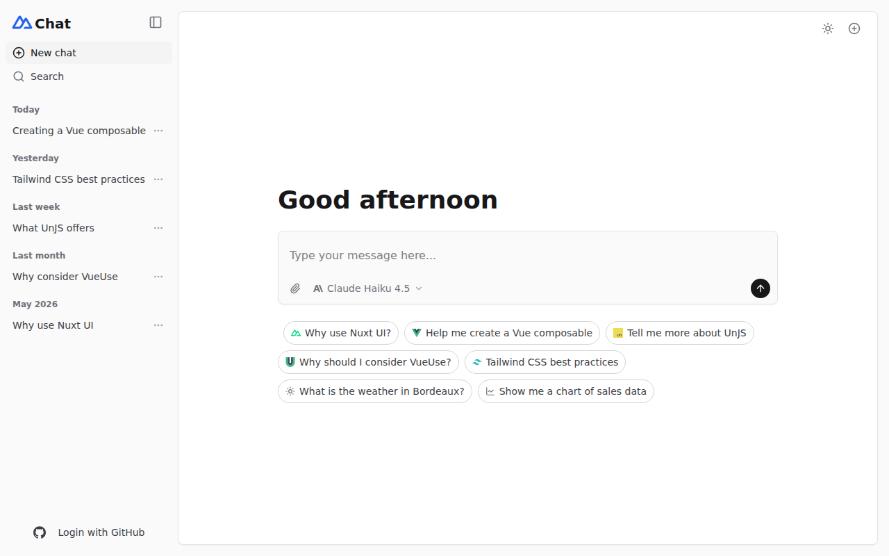
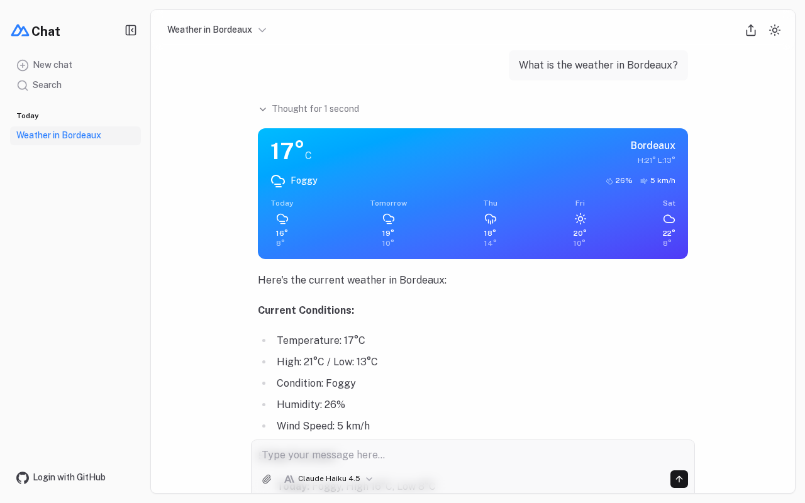
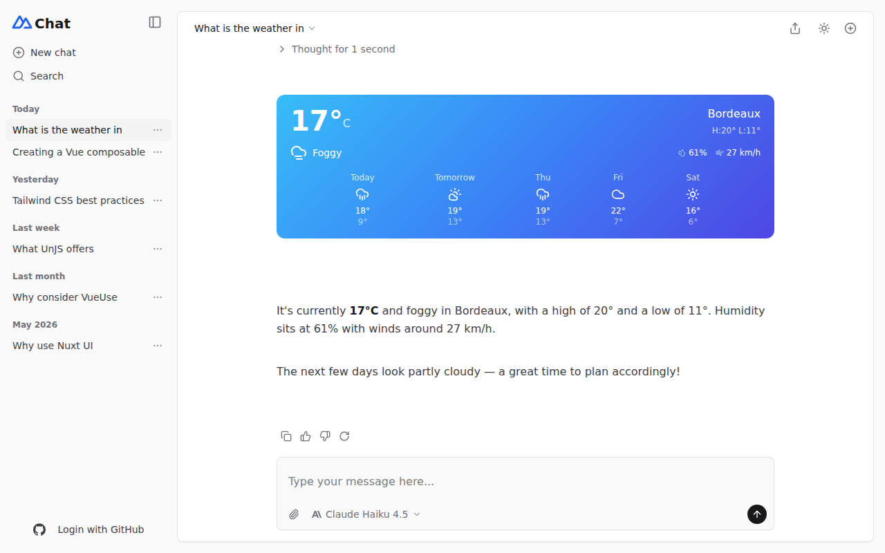
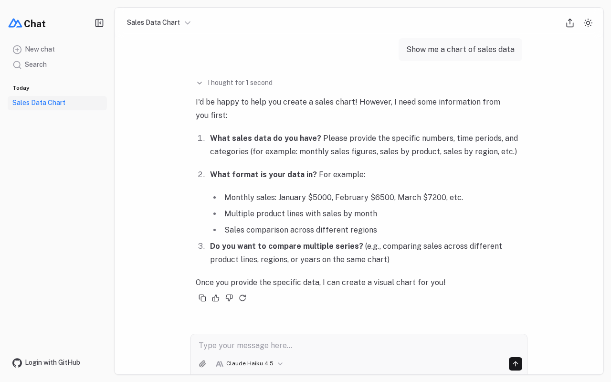
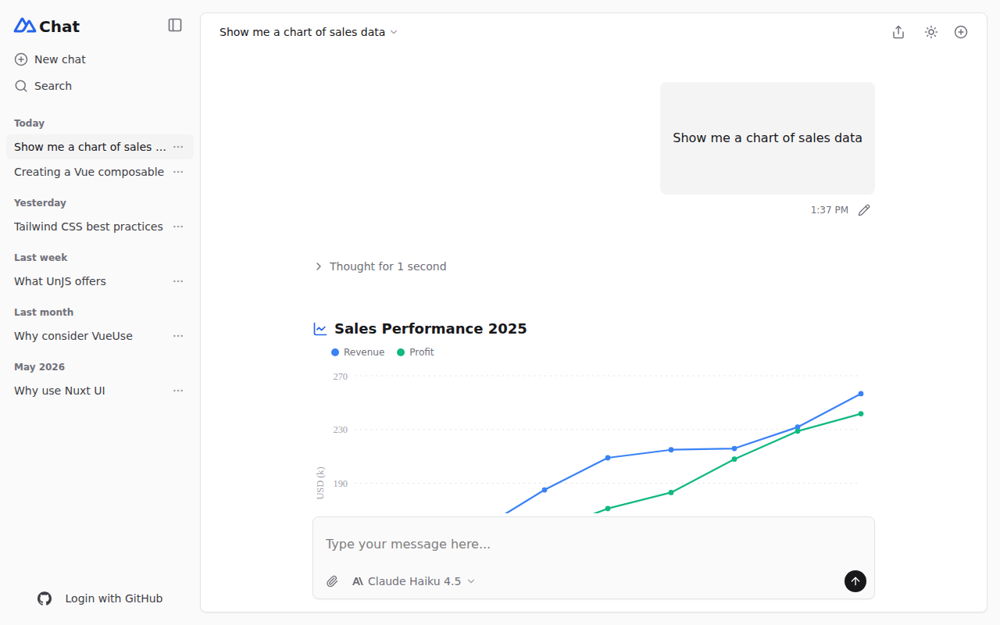
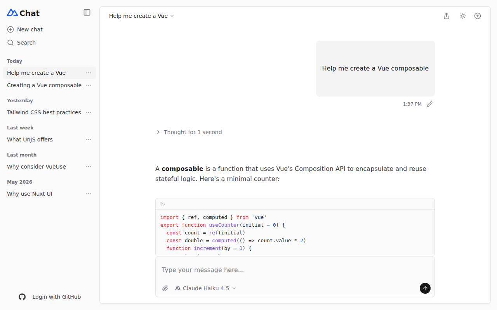
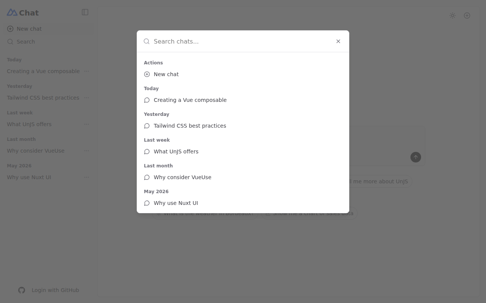

# Screenshot comparison — original vs Vue Lynx port

Both columns captured at 1280×800.

- **Original**: the live [chat-template.nuxt.dev](https://chat-template.nuxt.dev/) (real Nuxt app with real AI models), driven headlessly.
- **Lynx**: this example running on **Lynx for Web** (`rspeedy dev` → `/__web_preview`), backed by the example's mock server (deterministic streams).

| Surface | Original | Vue Lynx port |
|---|---|---|
| Home (light) |  |  |
| Weather tool chat |  |  |
| Chart prompt |  |  |
| Markdown + code |  |  |
| Home (dark) |  |  |
| Search palette |  |  |

## Reading the pairs

**Home (light/dark)** — sidebar structure (logo + wordmark, collapse toggle, New chat/Search with
active-route highlight, login footer), the greeting, prompt box (paperclip, model select,
rounded send button, placeholder text) and the quick-chat pills all line up. Detail differences:
the original loads the *Public Sans* webfont (Lynx renders the system sans), pill icon glyphs are
identical Iconify sources, and Lynx's panel corners/borders are marginally heavier.

**Weather chat** — user bubble right-aligned, "Thought for 1 second" collapsed reasoning row,
gradient weather card with current conditions + 5-day forecast, streamed markdown summary,
message actions (copy/vote/regenerate) and the sidebar title all match. The mock's seeded data
happened to generate the same 17° foggy Bordeaux as the live model run — coincidence, but a
handy one.

**Chart prompt** — the live model chose to ask clarifying questions instead of calling its chart
tool on this run (tool use is non-deterministic on the live demo), so the original screenshot
shows a text response; the port's deterministic mock always renders the chart card
(SVG polylines + legend + tap-tooltip, styled after the original's Unovis chart).

**Markdown + code** — ordered/unordered lists, bold, inline code chips and fenced code blocks
with syntax highlighting. The original highlights with Shiki grammars; the port uses a
lightweight regex tokenizer with github-ish token colors, so colors are similar but not
token-identical.

**Search palette** — the original's ⌘K modal vs the port's overlay: same input header, grouped
results. The original dims the page behind the modal with a translucent backdrop; translucent
overlay backgrounds don't composite on the Lynx web platform, so the port fades the underlying
content instead (see PORTING.md "Platform learnings" #4).
