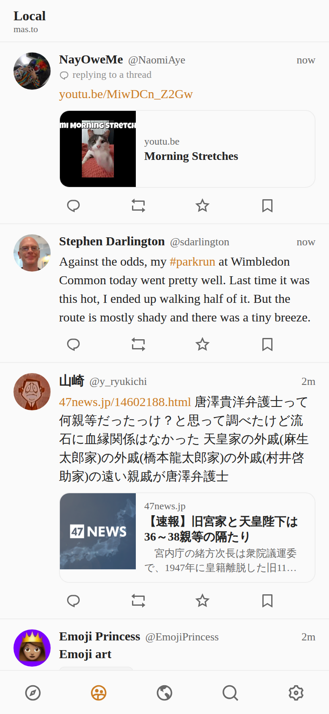
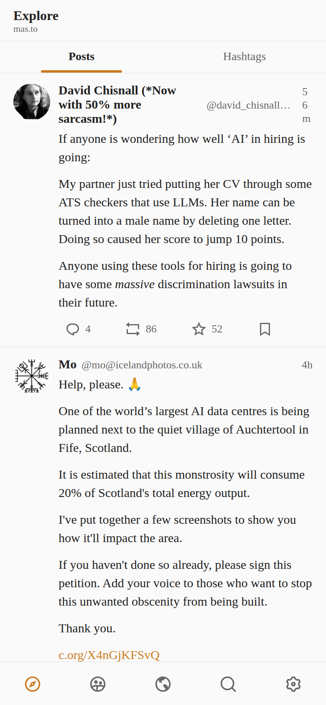

# Elk on Lynx

A native Mastodon client built with **Vue Lynx** by porting
[Elk](https://github.com/elk-zone/elk) — reusing Elk's framework-agnostic
layers (masto.js API client, Mastodon-HTML content pipeline, domain logic,
theme) and rebuilding its UI on Lynx native elements.

| Local timeline | Explore | Dark mode |
| --- | --- | --- |
|  |  |  |

## Features

Anonymous browsing of any Mastodon instance (default `mas.to`): local /
federated timelines with native `<list>` virtualization and infinite
scroll, rich status cards (custom emoji, mentions, hashtags, markdown,
content warnings, sensitive-media blur, media grids, link preview cards,
quote posts, polls), thread view, account profiles (banner, fields,
posts/replies/media tabs, follower lists), trending posts / hashtags /
news, debounced search, fullscreen media preview, dark mode, and
Elk-compatible optimistic actions (reply/boost/favourite/bookmark) plus
compose — the latter enabled by pasting an access token in Settings.

See [PRD.md](./PRD.md) for the full feature-parity checklist against Elk
(including what's deliberately not ported and why),
[PORTING.md](./PORTING.md) for the reused-vs-rebuilt architecture map, and
[screenshots/](./screenshots/README.md) for side-by-side comparisons with
the original elk.zone.

## Run

```bash
pnpm install
pnpm dev    # scan the QR code with LynxExplorer, or open the web preview
pnpm build  # dist/main.lynx.bundle + dist/main.web.bundle
```

The app talks to `https://<instance>` directly. Deep-link a route by
passing `globalProps: { initialPath: '/mas.to/tags/caturday' }` to the
LynxView (native) or `<lynx-view global-props=...>` (web).

### Web preview / screenshot harness

[`harness/`](./harness/) contains a minimal `@lynx-js/web-core` host page
plus the Playwright capture scripts used for the screenshot comparisons —
including relays for sandboxed environments where browser TLS egress is
blocked (see PORTING.md "Verification setup").

## Notable Lynx adaptations

- Free-identifier web globals (`fetch`, `Request`, `AbortSignal`, …) are
  rewritten to `globalThis.*` at build time (`source.define`) because the
  Lynx background-thread eval scope hides them — this is what lets
  masto.js run unpatched.
- Elk's content renderer keeps its ultrahtml parse/sanitize/transform
  pipeline verbatim; only the vnode emission changed
  (`<p>/<a>/` → `<text>/<image>` with tap navigation).
- Elk's DOM virtual scroller (virtua) is replaced by Lynx's native
  recycling `<list>` — less code, native performance.
- RemixIcon glyphs (Elk's `i-ri:*`) ship as tinted SVG data-URIs.
