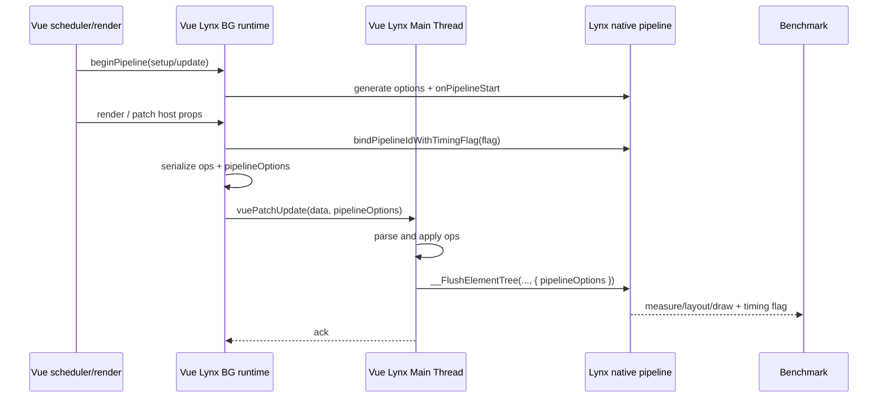

# Vue Lynx × Lynx Benchmark Timing Pipeline 接入计划

> 日期：2026-08-03  
> 状态：待执行  
> 目标仓库：`vue-lynx`  
> 目标：让 Vue VDOM、Vue Vapor 与 IFR 产生可被 Lynx Benchmark / PerfLab 正确归因的 setup/update pipeline 数据，并与 ReactLynx、TTML 使用同一套 native Render Time 口径。

## 0. 结论先行

当前问题不是 benchmark case 没有写 `__lynx_timing_flag`，也不是把这个字段作为普通 prop 下发给 `<view>` 就算完成接入。

当前 Vue Lynx 已经会把 `__lynx_timing_flag` 当普通 host prop 编译并通过 `OP.SET_PROP` 传给主线程，但没有完成下面这条性能 pipeline 链路：

1. 在一次 Vue render/update 开始前创建 Lynx performance pipeline。
2. 遇到非空 `__lynx_timing_flag` 时，把 flag 绑定到当前 pipeline ID。
3. 在 Vue render、patch、序列化、主线程解析/应用等关键阶段写 timing mark。
4. 把 `pipelineOptions` 随 `vuePatchUpdate` 从 Background Thread 传到 Main Thread。
5. 用同一个 `pipelineOptions` 调用 `__FlushElementTree(..., { pipelineOptions })`，让 native measure/layout/draw 归属于该 pipeline。

因此这次要接的是“框架更新批次 → Lynx native pipeline”的完整协议。`__lynx_timing_flag` 只是 benchmark 用来选择和命名目标 pipeline 的保留标记，不是最终计时 API。

## 1. Ground truth

### 1.1 当前 Vue Lynx 的断点

| 环节 | 当前实现 | 缺失 |
| --- | --- | --- |
| VDOM prop | `runtime/src/node-ops.ts` 的 `patchProp()` 最终发出 `OP.SET_PROP` | 没有识别并绑定 timing flag |
| Vapor prop | `runtime/src/shadow-element.ts` 的 `setAttribute()` 最终发出 `OP.SET_PROP` | 没有识别并绑定 timing flag |
| BG 批次发送 | `runtime/src/flush.ts` 发送 `{ data }` | 没有携带 `pipelineOptions` |
| MT 接收 | `main-thread/src/entry-main.ts` 的 `vuePatchUpdate({ data })` | 不接收 pipeline 信息 |
| native flush | `main-thread/src/ops-apply.ts` 调用裸 `__FlushElementTree()` | native 阶段无法归因到该 pipeline |
| 初次渲染 | 普通模式与 IFR 分别走 BG 首批 ops、MT `runIfrRender()` | 没有统一 setup pipeline 边界 |

### 1.2 Benchmark 实际读取的字段

`benchmark_script/utils.js` 的行为必须作为兼容契约，而不是重新发明一套总耗时：

- setup 数据来自 `lynxSetupTiming`，runner 会解析其中任意 `xxxStart` / `xxxEnd` 成对字段。
- update 数据来自 `lynxUpdateTimings`，同样解析任意成对字段。
- `pipelineTiming` 由 native pipeline 的 `drawEnd - (pipelineStart || startTime)` 合成。
- 直链 `.lynx.bundle` 不会由 runner 合成 `createLynx + loadBundle` 形式的 `totalTiming`；那条逻辑只适用于 testbench URL。
- `measureTiming`、`layoutTiming`、`drawTiming` 等是 native/container 阶段，Vue 框架不应伪造同名结果。

### 1.3 两类指标必须分开

跨框架可比较的主指标：

- `pipelineTiming` / Render Time
- native `measureTiming`
- native `layoutTiming`
- native `drawTiming`
- PerfLab 外部采集的 Render CPU Time
- PerfLab 外部采集的 Render Delta Memory

Vue 自身用于诊断的辅助指标：

- `vueRenderStart` / `vueRenderEnd`
- `vuePatchStart` / `vuePatchEnd`
- `packChangesStart` / `packChangesEnd`
- `parseChangesStart` / `parseChangesEnd`
- `applyChangesStart` / `applyChangesEnd`
- `vueHydrateStart` / `vueHydrateEnd`（仅 IFR hydration）

辅助指标可以帮助判断成本发生在 Vue、跨线程 wire 还是 native 渲染，但不能替代 Render Time 主指标。

## 2. 需要使用的 Lynx API

实现前先用当前目标 Lynx SDK 的类型与真机能力核对签名。预期与 ReactLynx 已使用的内部能力对齐：

```ts
lynx.performance._generatePipelineOptions()
lynx.performance._onPipelineStart(pipelineID, options)
lynx.performance._bindPipelineIdWithTimingFlag(pipelineID, timingFlag)
lynx.performance._markTiming(pipelineID, timingKey)
lynx.getNativeApp().markTiming(timingFlag, timingKey) // 仅兼容旧引擎时使用
__FlushElementTree(page?, { pipelineOptions })
```

`pipelineOptions` 至少需要验证并正确设置：

- `pipelineID`
- `needTimestamps`
- `pipelineOrigin`
- `dsl`
- `stage`

约束：

- 优先复用 ReactLynx 对这些字段的值与语义，避免 Vue 自定义新枚举。
- 新 API 不存在时才走 `markTiming(flag, key)` 兼容路径。
- 兼容路径不能伪造 native measure/layout/draw；它只负责框架自定义 mark。
- 这些能力先保持为 Vue Lynx 内部实现，不暴露成用户级 public API。

## 3. 目标架构

### 3.1 新增批次级 timing context

新增建议文件：

```text
packages/vue-lynx/runtime/src/performance.ts
```

职责：

- 在一次 Vue scheduler tick/render 批次开始前创建 pipeline。
- 保存当前批次的 `pipelineID`、`pipelineOptions`、timing flag 和已写 mark。
- VDOM/Vapor 共用同一个 `captureTimingFlag()`。
- 对同一批次只生成一个 pipeline。
- 在 BG 数据交付给 MT 后清空 context，防止 flag 串到下一批更新。
- API 不可用时安全 no-op，不能影响渲染。

建议内部接口：

```ts
type VueLynxPipelineContext = {
  pipelineID: string;
  pipelineOptions: Record<string, unknown>;
  timingFlag?: string;
};

beginPipeline(stage: 'setup' | 'update'): void;
markPipelineTiming(key: string): void;
captureTimingFlag(value: unknown): void;
takePipelineOptions(): Record<string, unknown> | undefined;
resetPipelineContext(): void;
```

最终类型应从 Lynx SDK 复用；上面的 `Record` 只表示计划阶段不能凭记忆复制一份漂移的 contract。

### 3.2 pipeline 的生命周期



关键边界：pipeline 不能在 `doFlush()` 中才创建。`doFlush()` 发生在 Vue 当前 scheduler tick 的 render/patch 之后，如果在那里开始，框架 render/diff 成本会被排除在 pipeline 外。

### 3.3 timing flag 的处理规则

`__lynx_timing_flag` 作为保留 host prop，VDOM 和 Vapor 必须走同一 helper：

- 空字符串、`null`、`undefined` 不绑定，也不生成有效样本。
- 值没有变化时不重复绑定。
- 同一批次重复出现相同 flag：允许。
- 同一批次出现多个不同的非空 flag：第一个 flag 生效；开发模式警告一次并记录测试，避免后一个元素静默改写整个 pipeline 的归属。
- prop 是否继续发给 native View，需在 M0 用 ReactLynx 行为验证后决定。默认保持现状下发，以免破坏 native timing flag 识别；不得先入为主地吞掉该 prop。

### 3.4 setup、update 与 IFR 分开处理

普通初次 mount：

- setup pipeline 必须在 `createApp().mount()` 导致的首次 render 之前开始。
- 首批 ops 使用同一 `pipelineOptions` 完成 MT/native flush。
- 真机验证它最终进入 `lynxSetupTiming` 还是 `lynxUpdateTimings`。
- 如果当前 Lynx API 无法把框架发起的首屏 pipeline 挂入 `lynxSetupTiming`，将其记录为 engine/container API gap；不能在 Vue 层合成假的 `totalTiming`。

普通 update：

- 在响应式更新的 render effect 开始前创建 update pipeline。
- 只有该批次捕获到非空 timing flag 时才打开 `needTimestamps` 并绑定 flag。
- MT `__FlushElementTree` 完成后由 native 输出 pipeline 与各渲染阶段。

IFR：

- MT 首屏不能依赖 BG `onMounted`，因为 IFR 首次 render 在 MT 执行。
- setup timing 要包住 `runIfrRender()` 及其首次 `__FlushElementTree(page, ...)`。
- BG hydration/replay 使用独立 `vueHydrate*` mark，不得和 MT 首屏 pipeline 重复记为两次 Render Time。
- `interceptPatchUpdate()` 跳过或修补 hydration batch 时，也要明确 pipeline 由谁结束，避免产生只有 start 没有 drawEnd 的孤立数据。

## 4. 分阶段执行

### M0 — 固化 contract 与失败测试

目标：先证明断点，再动实现。

- [ ] 以当前 benchmark 使用的 ReactLynx runtime 为参照，记录 performance API 的准确签名、字段值、fallback 条件和 `__FlushElementTree` 参数形式。
- [ ] 在当前 `@lynx-js/types` / engine globals 中确认 API 类型；如果缺类型但真机存在，创建最窄的内部 ambient type，不污染 public API。
- [ ] 确认 benchmark case 的 flag 变化发生在 mount 还是 update、一次批次是否可能出现多个 flag。
- [ ] 新增 VDOM 失败测试：有 flag 的更新应把同一 pipeline ID 传到 MT flush。
- [ ] 新增 Vapor 失败测试：行为与 VDOM 一致。
- [ ] 新增无 flag 测试：正常更新不得产生 benchmark timing 样本。
- [ ] 新增冲突 flag 测试：first-wins，开发模式有警告。
- [ ] 新增 API 缺失测试：性能能力不可用时渲染结果不受影响。

交付物：一组先失败的 contract tests，以及代码注释中指向的准确 Lynx API 事实。

### M1 — 建立共享 performance context

- [ ] 新增 `runtime/src/performance.ts`，封装 generate/start/bind/mark/reset。
- [ ] 找到 VDOM 与 Vapor 都能覆盖的最窄 scheduler/render 起点；不得只在 post-flush 创建 pipeline。
- [ ] 明确 setup/update stage 的来源，并与 ReactLynx 的 `pipelineOrigin`、`dsl`、`stage` 对齐。
- [ ] context 以批次为单位，保证异常、空 ops、API no-op 和测试 reset 都会清理状态。
- [ ] 对开发警告去重，production 不输出日志。

退出条件：不接 MT 之前，单元测试已经能证明一个 tick 只有一个 context，flag 绑定和 reset 正确。

### M2 — 接入 VDOM 与 Vapor 的 timing flag

修改点：

- `packages/vue-lynx/runtime/src/node-ops.ts`
- `packages/vue-lynx/runtime/src/shadow-element.ts`

任务：

- [ ] VDOM `patchProp()` 在通用 prop 分支前调用共享 `captureTimingFlag()`。
- [ ] Vapor `setAttribute()` / `removeAttribute()` 使用相同规则。
- [ ] 覆盖模板 prototype/clone 路径，确认 inert element 不会提前绑定一个并未真正渲染的 flag。
- [ ] 验证 `v-bind` spread、fallthrough attrs、静态模板 hole 都不会绕过 helper。
- [ ] 检查 `VueLynxProps<IntrinsicElements['view']>` 是否已经允许该 prop；只有缺失时才补内部/特殊 prop 类型和 type-test。

退出条件：VDOM、Vapor 对 flag 的捕获语义完全一致，普通 prop/event/class/style 行为无回归。

### M3 — 打通 BG → MT → native pipelineOptions

修改点：

- `packages/vue-lynx/runtime/src/flush.ts`
- `packages/vue-lynx/main-thread/src/entry-main.ts`
- `packages/vue-lynx/main-thread/src/ops-apply.ts`
- 必要时 `vue-lynx/internal/ops` 的 wire contract/type

任务：

- [ ] `doFlush()` 在序列化前取得当前批次的 `pipelineOptions`。
- [ ] `callLepusMethod('vuePatchUpdate', ...)` payload 从 `{ data }` 扩展为 `{ data, pipelineOptions? }`，保持旧 MT 对缺省字段的兼容。
- [ ] MT handler 接收并校验可选 `pipelineOptions`；不信任任意用户 payload。
- [ ] `applyOps()` 增加可选 flush context，并传给最终 `__FlushElementTree`。
- [ ] 明确是否需要显式 page 参数；以目标引擎和现有 ReactLynx 调用为准，不凭测试 stub 猜测。
- [ ] IPC 发出后清理 BG context；ack 仍只承担 `nextTick()` 的 MT 应用完成语义，不被 timing 逻辑改变。
- [ ] `ops.length === 0`、JSON 序列化失败、app 不存在、MT 拒绝 payload 时都不泄漏 context。

退出条件：双线程测试能断言创建、绑定、BG payload、MT apply 和 native flush 使用的是同一个 pipeline ID。

### M4 — 添加 Vue 框架诊断 mark

- [ ] 在准确边界添加 `vueRenderStart/End`，不要用 `scheduleFlush()` 时间替代 render 开始时间。
- [ ] 在 renderer host patch 边界添加 `vuePatchStart/End`。
- [ ] ops JSON 序列化使用 `packChangesStart/End`。
- [ ] MT `JSON.parse` 使用 `parseChangesStart/End`。
- [ ] MT `applyOps` 使用 `applyChangesStart/End`。
- [ ] 所有 mark 必须成对；异常路径用 `try/finally` 保证 end 或明确丢弃整个样本。
- [ ] 和 ReactLynx 的 `diffVdom*`、`packChanges*`、`parseChanges*`、`patchChanges*` 做映射说明，但不为了名称相同而混淆不同边界。

退出条件：Benchmark raw result 能同时看到 native pipeline 主指标与 Vue 自身诊断 pair；文档明确哪些字段可以跨框架比较。

### M5 — 普通初次 mount/setup

- [ ] 找到应用 mount 的统一入口，在首次 Vue render 前开启 setup pipeline。
- [ ] 保证首批 BG ops 携带 setup `pipelineOptions`。
- [ ] 验证首次 `__FlushElementTree` 的 drawEnd 能结束同一 pipeline。
- [ ] 区分首次 mount 与后续 update，不能把每次 scheduler tick 都标记成 setup。
- [ ] 真机读取 `lynxSetupTiming` 与 `lynxUpdateTimings`，确认 engine 的最终归档位置。
- [ ] 如果只能得到 update pipeline，建立 engine issue/接口需求，并让 PerfLab 文档明确“setup 暂缺”，禁止映射成旧表 `totalTiming`。

### M6 — IFR 首屏与 hydration

修改点候选：

- `packages/vue-lynx/main-thread/src/entry-main.ts`
- `packages/vue-lynx/main-thread/src/ifr.ts`
- `packages/vue-lynx/runtime/src/flush.ts`

任务：

- [ ] 在 MT `runIfrRender()` 前开始 IFR setup pipeline。
- [ ] 把其 options 传给 `__FlushElementTree(page, { pipelineOptions })`。
- [ ] 为 BG hydration 添加 `vueHydrateStart/End`，但不重复创建首屏 Render Time。
- [ ] 覆盖 hydration 完整匹配、严格前缀、分批、fallback 和 mismatch 路径。
- [ ] 验证 `vueIfrHydrationComplete` 及 ack fallback 不会提前结束/遗留 timing context。

退出条件：IFR 只有一个首屏 native pipeline，hydration 成本可诊断，页面结果与现有 correctness tests 一致。

### M7 — 真机与 PerfLab 验证

本地/真机最小矩阵：

| 模式 | setup | 带 flag update | 无 flag update | 预期 |
| --- | --- | --- | --- | --- |
| Vue VDOM | ✓ | ✓ | ✓ | 有 flag 时出现 native pipeline |
| Vue Vapor | ✓ | ✓ | ✓ | 与 VDOM 相同 contract |
| Vue VDOM IFR | ✓ | ✓ | ✓ | 首屏只记一次 |
| Vue Vapor IFR | ✓ | ✓ | ✓ | 首屏只记一次 |

- [ ] 选择一个小 case 和一个重 case，先本地跑 bundle 并保存 raw JSON。
- [ ] 每个 timing flag 恰好对应一个有效 update sample。
- [ ] sample 至少含 pipeline start/draw end，且 native measure/layout/draw 非空时单位、数量级合理。
- [ ] Vue 自定义 pair 成对且嵌套顺序合理。
- [ ] 与同 case 的 ReactLynx/TTML 对比字段来源，不先比较绝对性能结论。
- [ ] 再发布完整 benchmark cases 并重跑 PerfLab。
- [ ] 单独修复/确认 PerfLab manifest 中 `interval` 与 `enableJSRuntime`；这是 benchmark 发布侧问题，不在本仓库实现，但会影响 14 秒 flag 是否在默认 12 秒窗口后被截断。
- [ ] 新报告明确标注 commit、bundle URL、case 数、成功/失败/缺失数和字段口径。

## 5. 测试计划

### 5.1 自动化测试落点

优先扩展/复用：

- `packages/upstream-tests/src/flush-ack.spec.ts`
- `packages/upstream-tests/src/vapor/vapor-runtime.spec.ts`
- `packages/upstream-tests/src/vapor/vapor-sfc-e2e.spec.ts`
- `packages/upstream-tests/src/vapor/ifr.spec.ts`
- `packages/upstream-tests/src/mt/**`
- `packages/vue-lynx/types/type-tests/special-props.test.ts`

建议新增双线程 contract test，stub 并记录：

- `lynx.performance` 的 generate/start/bind/mark 调用顺序。
- `callLepusMethod` 的 `pipelineOptions` payload。
- MT `vuePatchUpdate` 接收到的 options。
- `__FlushElementTree` 最终收到的同一 pipeline ID。

### 5.2 每阶段最低命令

```bash
pnpm --filter vue-lynx-upstream-tests test:dom
pnpm --filter vue-lynx-upstream-tests test:vapor
pnpm --filter vue-lynx-upstream-tests test
pnpm lint
pnpm build
```

IFR 或共享 runtime 改动完成后，必须再跑完整上游矩阵：

```bash
pnpm test:upstream
```

### 5.3 不可仅靠单测通过的验证

- engine 是否真正把 `pipelineOptions` 归档为 `lynxSetupTiming` / `lynxUpdateTimings`。
- `drawEnd` 是否来自目标帧而不是下一帧或空 pipeline。
- PerfLab 的 CPU/Memory 采集是否覆盖相同 workload 窗口。
- 各目标 Lynx SDK 版本是否都支持 performance 私有 API。

这些必须用 Android 真机 raw result 回读验证。

## 6. 验收标准

功能验收：

- [ ] VDOM、Vapor、VDOM IFR、Vapor IFR 均能把 timing flag 绑定到真实 native pipeline。
- [ ] BG、MT、native flush 的 pipeline ID 一致。
- [ ] 无 flag 的业务更新不产生 benchmark 定向样本。
- [ ] timing API 缺失或老引擎 fallback 不影响渲染正确性。
- [ ] `nextTick()`/ack、IFR hydration、模板、list、worklet 现有行为无回归。

数据验收：

- [ ] Vue raw result 不再只有约 4ms 的 generic built-in setup 值。
- [ ] 每个预期 flag 能找到对应 sample，缺失/重复有明确清单。
- [ ] Render Time 来自 native pipeline，不来自 Vue 自己拼出的 `totalTiming`。
- [ ] Vue 自定义 mark 仅作为诊断列，不冒充跨框架指标。
- [ ] CPU/Memory 保持 PerfLab 外部采集口径，不要求 View 侧额外 API。

工程验收：

- [ ] 所有新增内部 contract 有类型和测试。
- [ ] 性能逻辑集中封装，VDOM/Vapor 不各自复制实现。
- [ ] 不把 Lynx 私有 performance API 暴露成稳定 public Vue API。
- [ ] 完整测试、构建、真机 raw result 和 PerfLab 重跑信息可追溯到同一 commit。

## 7. 风险与止损线

1. **私有 API 版本差异**：先完成 capability detection；不能因为旧引擎缺 API 让页面崩溃。
2. **pipeline 开始太晚**：如果只能在 `doFlush()` 开始，本计划视为未完成，因为 Vue render 成本仍不在主 pipeline 内。
3. **首屏归档受 engine 控制**：拿不到 `lynxSetupTiming` 时提交 engine gap，不在 Vue 层伪造 `totalTiming`。
4. **IFR 双计时**：MT 首屏与 BG hydration 必须有唯一 owner；检测到两个 native 首屏 sample 即验收失败。
5. **多 flag 合批**：先采用 first-wins + dev warning；如果 benchmark 确实要求一批多 flag，需要升级 wire/native contract，而不是静默复制一个 pipeline。
6. **观测改变调度**：mark 和序列化观测不得新增异步边界、额外 flush 或改变 ops 顺序。
7. **PerfLab 运行窗口**：`interval` / `enableJSRuntime` 缺失会造成 case 截断，必须在框架接入验证后、全量重跑前作为发布侧 gate 关闭。

## 8. 执行顺序与提交建议

建议按下面的可独立回滚提交推进：

1. `test: lock benchmark timing pipeline contract`
2. `feat(runtime): add batch performance context`
3. `feat(runtime): capture timing flag in vdom and vapor`
4. `feat(runtime): propagate pipeline options to main thread flush`
5. `feat(runtime): add vue diagnostic timing marks`
6. `feat(ifr): instrument initial render and hydration`
7. `test: add device evidence and benchmark fixtures`（只提交脱敏、稳定的小型 fixture）

在 M3 真机确认 native pipeline 成功前，不开始大规模 PerfLab 重跑；在 M5/M6 明确 setup/IFR 归档前，不更新跨框架结论表。

## 9. 第一轮执行清单

开始编码时按以下顺序完成第一轮：

1. 从 benchmark 当前锁定版本的 ReactLynx runtime 抄录“行为”，不复制实现，形成 API contract test。
2. 写 VDOM/Vapor 失败测试，证明当前 `{ data }` 和裸 `__FlushElementTree()` 丢失 pipeline。
3. 建立共享 context，并找到早于 Vue render 的稳定启动点。
4. 打通一个 VDOM update 的端到端 pipeline，真机回读 raw result。
5. 同一实现扩展到 Vapor，而不是另写一套。
6. 再处理普通 setup 与 IFR。
7. 最后才加入更多诊断 mark、修 PerfLab manifest 并全量重跑。

第一轮成功标志：一个带 `__lynx_timing_flag` 的 Vue VDOM update，在 raw result 中能看到与该 flag 绑定的 native pipeline，并且 `__FlushElementTree` 使用的 pipeline ID 与 BG 创建的 ID 相同。
